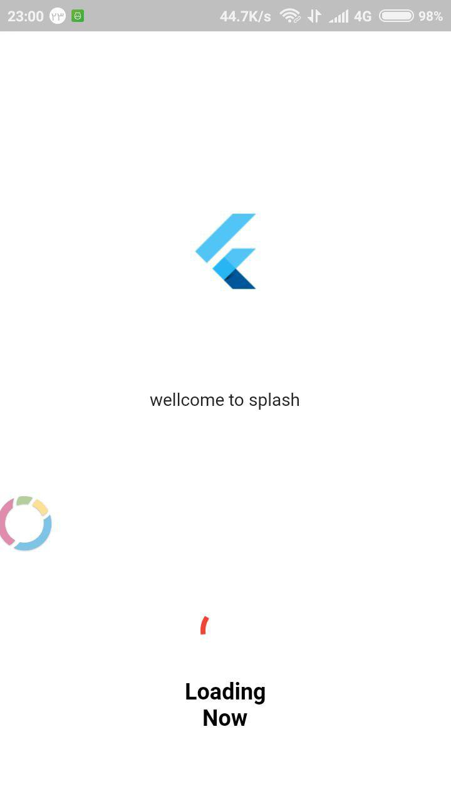

# custom_splash_screen

a flutter package for both android and ios that checks internet connection in
splash screen and makes custom splash screens for your applications.


### Screenshots

 

## Usage

[Example](in source)

To use this plugin :

* add the dependency to your [pubspec.yaml) file.

```yaml
  dependencies:
    flutter:
      sdk: flutter
    custom_splash_screen:
```
## Getting Started

https://pub.dev/packages/custom_splash_screen

For help getting started with Flutter, view our online [documentation](https://flutter.io/).

For help on editing package code, view the [documentation](https://flutter.io/developing-packages/).
